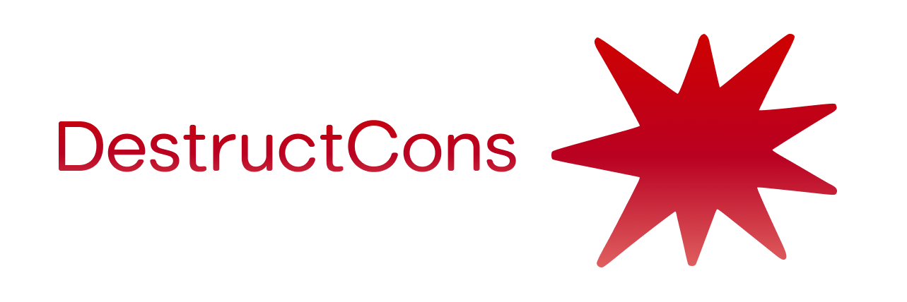

# DestructCons - Construct extension module

This provides a series of Icons for you to use in your Construct code.

Supports IconButton and Icon as well as any ImageLabel.

---

_All Icons are licensed by their creators. I do not own any rights to any._
